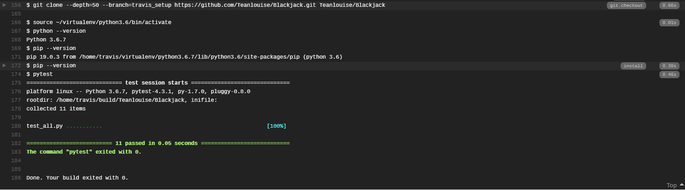
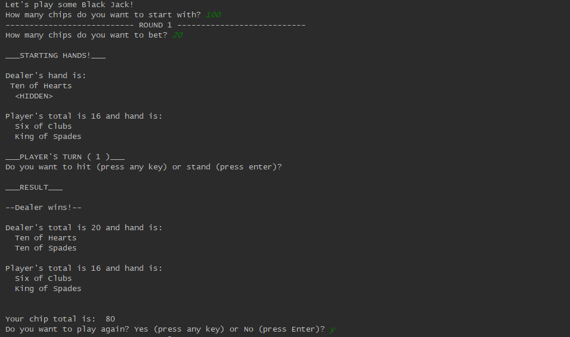
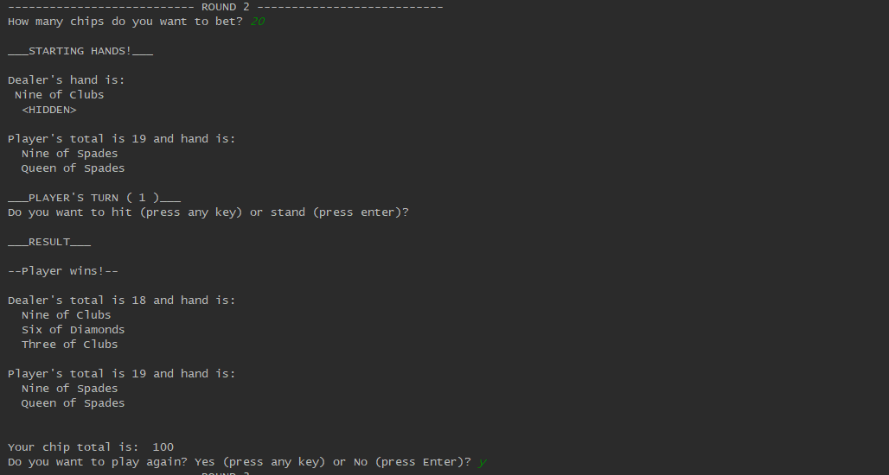
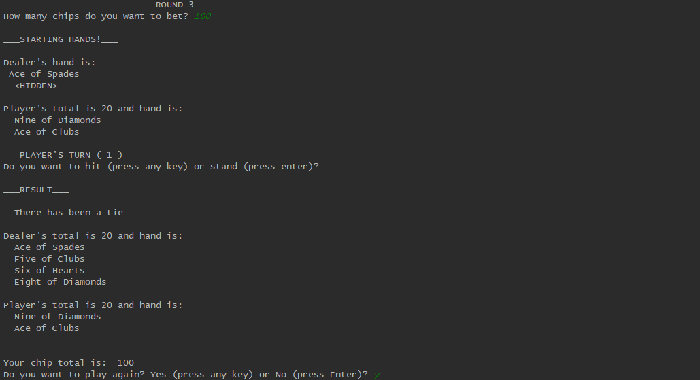
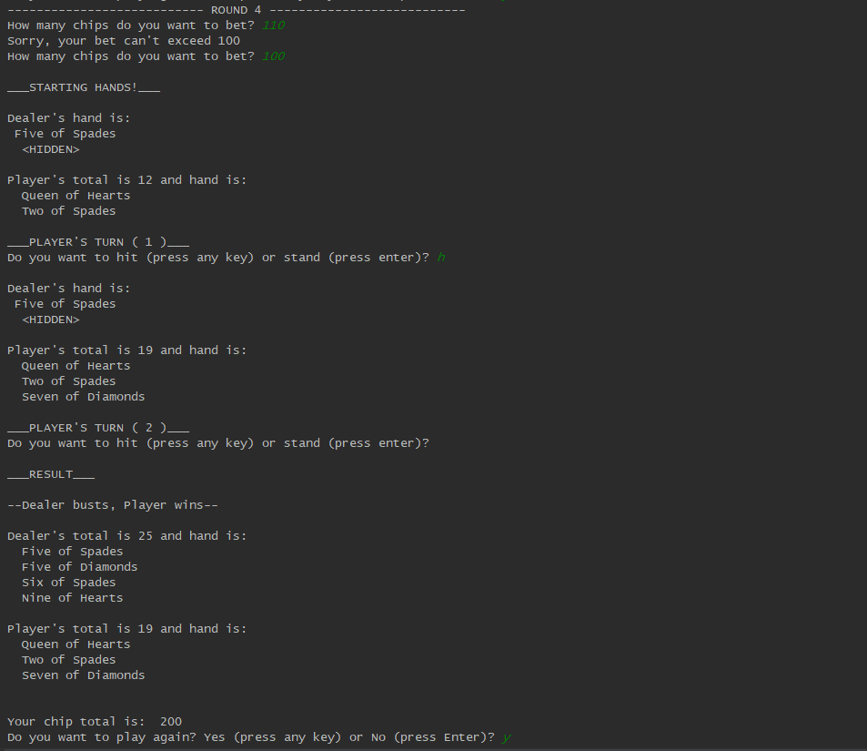
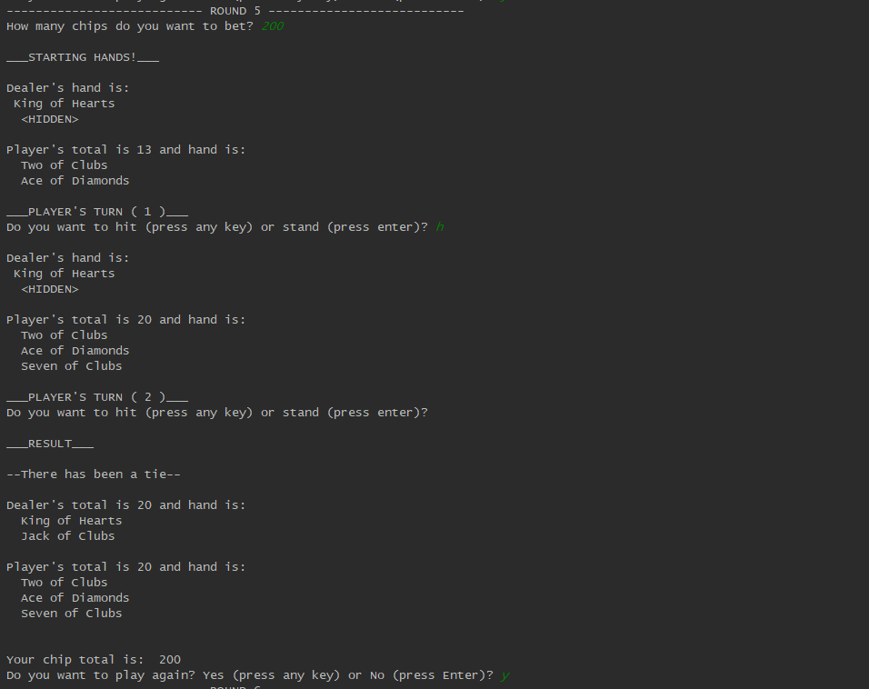
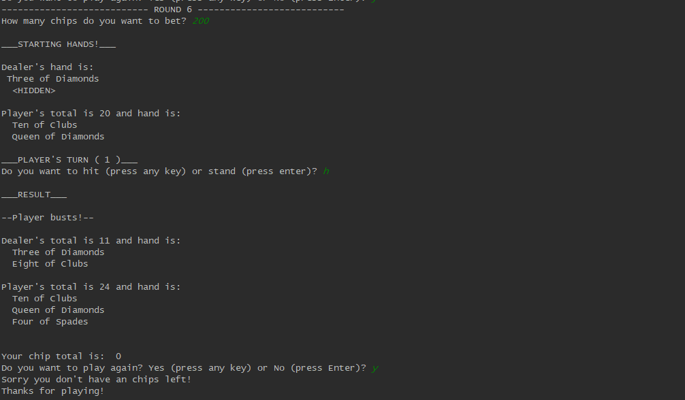

[Back to Home](https://teanlouise.github.io)

A simple blackjack game. This was completed as the milestone 2 project for Jose Portilla's "Zero-to-Hero Python" course. Basic Python functionality inlcuding Object-Oriented programming practices were used to implement this project.

Pytest was used to write a number of tests and automatic testing has been setup with Travis CI.

**Setup Travis CI:**
1. Create branch
`git checkout -b travis_setup`
2. Add .travis.yml file
3. Specify language
`language: python`
4. Must provide a script
`script: pytest`
5. No requirement.txt so need to override install
`install: pip --version`
6. Create test_name.py file with tests
7. Commit
 
**Gameplay:**
1. Create a bank roll according to user to be used for all subsequent games
2. Start the first round
3. Ask the player for their bet for this round
4. Make sure that the Player's bet does not exceed their available chips
5. Create a deck of 52 cards and shuffle
6. Deal two cards to the Dealer and two cards to the Player
7. Show only one of the Dealer's cards, the other remains hidden
8. Show both of the Player's cards
9. Ask the Player if they wish to Hit, and take another card
10. If the Player's hand doesn't Bust (go over 21), ask if they'd like to Hit again.
11. If a Player Stands, play the Dealer's hand. 
12. The dealer will always Hit until the Dealer's value meets or exceeds 17
13. Determine the winner 
14. Adjust the Player's chips accordingly to bank roll
15. Ask the Player if they'd like to play again
16. If so, start again from step 3

_The game starts with an introduction and prompt for how many chips to start with_
_(1) Dealer wins since they have a higher value than the player, lose the bet._

_(2) Payer wins since they have a higher value than the dealer, win the bet._ 

_(3) Both the dealer and the player have the same value, there is a tie and no change to players chips._

_(4) Betting more than available chips is not allowed. Player hits then stands, dealer busts so player wins and takes bet.__

_(5) Player bets all their chips, player hits and there is a tie. No change to chips._

_(6) Player bets all their chips, player hits and busts. Player has no balance left so the game ends._

